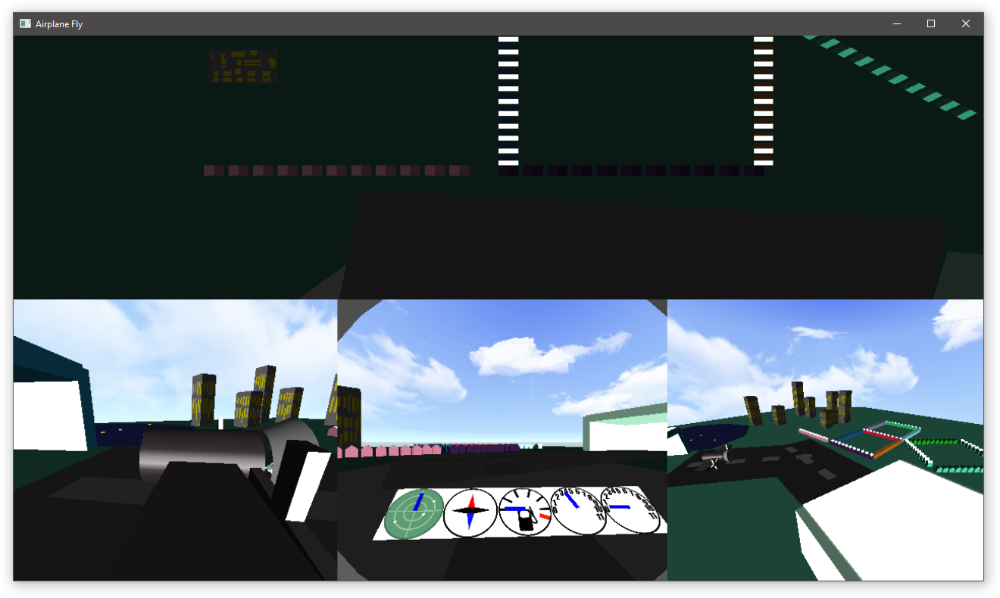

# Airplane
This program is a simulation of 3d aircraft flight simulation. The aircraft starts off at a airport terminal. When the user presses 1 the aircraft will take off and then begin a circle pattern, which it will continue to do until the user presses 4 then the aircraft lands on a different runway and taxies into a hanger.

While in the air the plane will execute a corkscrew when the user presses 2.

The screen itself shows four different views of the simulation, They can be switched by pressing tab.

The first view is first person, where some (slightly) accurate instruments show the planes current speed, altitude and amount of fuel, There is also a view from the wing of the plane showing a "3rd person" view of the planes flight

There is also a top down view of the whole scene.

The final view is one from a fixed perspective, showing the scene from a non moving camera, this is representative of a flight control tower watching over the plane flying.

Screenshot
----

